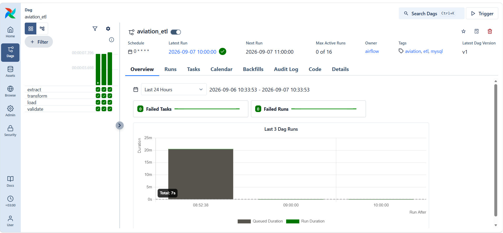
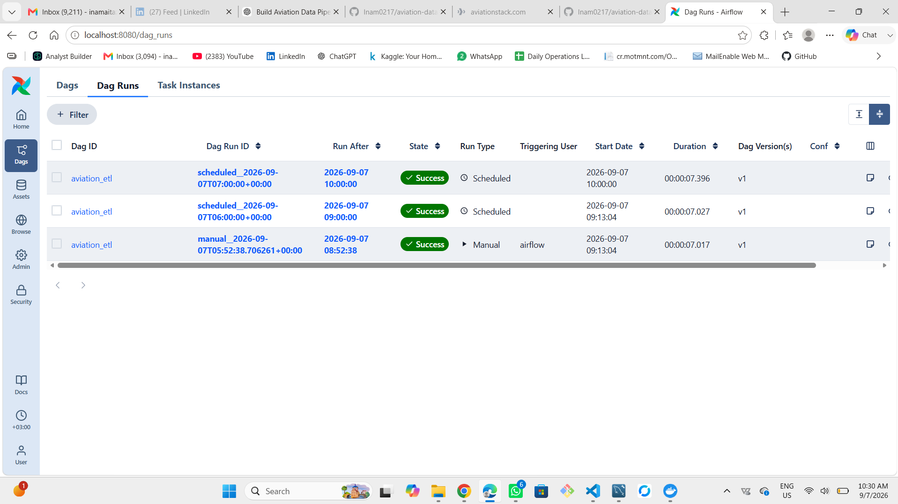
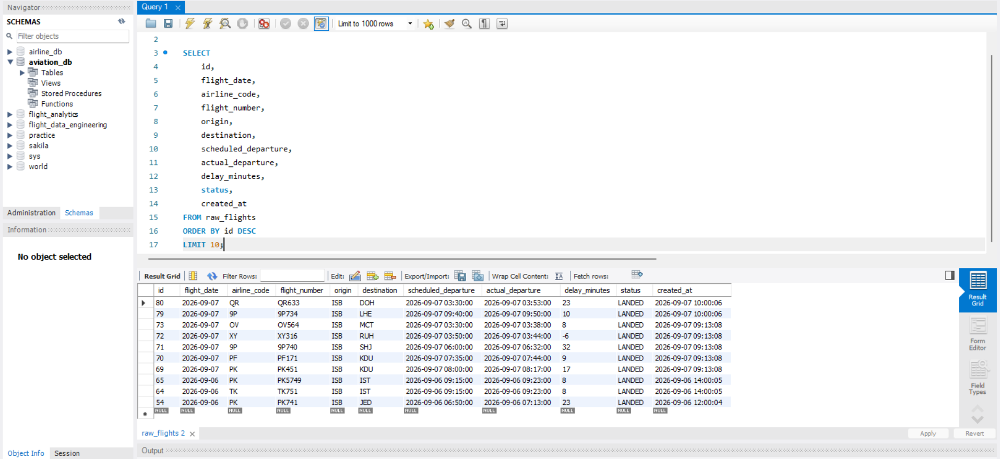

# ✈️ Aviation Data Engineering Pipeline

An end-to-end aviation data engineering project that extracts flight data from the AviationStack API, transforms and validates the data with Python, and loads it into MySQL using an Apache Airflow-orchestrated ETL pipeline.

The pipeline runs as an hourly batch workflow and includes SQL analytics for analyzing flight volume, destinations, airline performance, and delays.

---

## 📌 Project Overview

This project demonstrates a complete data engineering workflow:

```text
AviationStack API
       │
       ▼
   EXTRACT
       │
       ▼
   TRANSFORM
       │
       ▼
     LOAD
       │
       ▼
     MySQL
       │
       ▼
   VALIDATE
       │
       ▼
 SQL ANALYTICS
```

The workflow is orchestrated using Apache Airflow and runs automatically every hour.

---

## 🏗️ Architecture

```text
                     ┌──────────────────────┐
                     │   AviationStack API  │
                     └──────────┬───────────┘
                                │
                                ▼
                     ┌──────────────────────┐
                     │   Airflow Extract    │
                     └──────────┬───────────┘
                                │
                                ▼
                     ┌──────────────────────┐
                     │ Python Transformation│
                     │  - Clean data        │
                     │  - Normalize codes   │
                     │  - Calculate delays  │
                     └──────────┬───────────┘
                                │
                                ▼
                     ┌──────────────────────┐
                     │     MySQL Load       │
                     │    raw_flights       │
                     └──────────┬───────────┘
                                │
                                ▼
                     ┌──────────────────────┐
                     │      Validation      │
                     │   Row count check    │
                     └──────────┬───────────┘
                                │
                                ▼
                     ┌──────────────────────┐
                     │    SQL Analytics     │
                     └──────────────────────┘
```

---

## ⚙️ Technologies Used

- **Python**
- **Apache Airflow 3.3.1**
- **Docker / Docker Compose**
- **MySQL 8**
- **SQL**
- **AviationStack API**
- **Requests**
- **mysql-connector-python**
- **python-dotenv**
- **Git / GitHub**

---

## 📂 Project Structure

```text
aviation-data-engineering/
│
├── dags/
│   └── aviation_etl.py
│
├── sql/
│   └── analytics.sql
│
├── src/
│   ├── extract_flights.py
│   ├── transform_flights.py
│   ├── load_flights.py
│   └── run_pipeline.py
│
├── screenshots/
│   ├── airflow-dag-overview.png
│   ├── airflow-dag-runs.png
│   └── mysql-workbench-results.png
│
├── .env.example
├── .gitignore
├── docker-compose.yml
└── README.md
```

---

## 🔄 ETL Workflow

### 1. Extract

Flight data is retrieved from the AviationStack API.

The current pipeline retrieves landed flights departing from Islamabad International Airport (`ISB`).

The API response is processed using Python and Requests.

### 2. Transform

The transformation layer:

- Extracts relevant flight fields
- Normalizes airline and airport codes
- Converts API timestamps into Python datetime values
- Calculates departure delay in minutes
- Removes records missing required flight information
- Standardizes flight status values

Example transformed fields:

```text
flight_date
airline_code
flight_number
origin
destination
scheduled_departure
actual_departure
scheduled_arrival
actual_arrival
status
delay_minutes
```

### 3. Load

Transformed records are loaded into MySQL.

Target table:

```text
raw_flights
```

The database connection is configured through environment variables rather than hardcoded credentials.

### 4. Validate

After loading the data, Airflow runs a validation task.

The validation checks that:

- MySQL connection is available
- Required database configuration exists
- `raw_flights` contains records

The DAG fails if validation does not pass.

---

## ⏰ Airflow Scheduling

The DAG is configured with:

```text
0 * * * *
```

This means the ETL pipeline runs **once every hour**.

Each scheduled run performs:

```text
Extract → Transform → Load → Validate
```

This is an **hourly batch ETL pipeline**, not a streaming system.

---

## 🗄️ MySQL Data Model

The main table is:

```text
raw_flights
```

Important columns include:

| Column | Description |
|---|---|
| `id` | Auto-incrementing record ID |
| `flight_date` | Flight date |
| `airline_code` | Airline IATA code |
| `flight_number` | Flight IATA number |
| `origin` | Origin airport |
| `destination` | Destination airport |
| `scheduled_departure` | Scheduled departure time |
| `actual_departure` | Actual departure time |
| `scheduled_arrival` | Scheduled arrival time |
| `actual_arrival` | Actual arrival time |
| `status` | Flight status |
| `delay_minutes` | Departure delay in minutes |
| `created_at` | Database record creation timestamp |

---

## 📸 Pipeline Screenshots

### Airflow DAG Overview

The Airflow DAG orchestrates the complete ETL workflow:

```text
Extract → Transform → Load → Validate
```

The DAG is scheduled to run hourly.



### Airflow DAG Runs

The Airflow interface shows successful scheduled and manual executions of the `aviation_etl` pipeline.



### MySQL Workbench

The transformed flight records are loaded into the `raw_flights` table in MySQL.

The screenshot shows the SQL query and actual records returned from the database, including flight information, scheduled and actual departure times, calculated delays, status, and load timestamps.



---

## 📊 SQL Analytics

The project includes `sql/analytics.sql`.

The queries provide analysis such as:

- Total number of flights
- Flights by airline
- Flights by destination
- Average delay by airline
- Delayed vs. on-time flights
- Flight status distribution
- Overall average delay
- Most delayed flights
- Daily flight volume
- Airline performance summary

Example:

```sql
SELECT
    airline_code,
    COUNT(*) AS total_flights,
    ROUND(AVG(delay_minutes), 2) AS average_delay_minutes
FROM raw_flights
GROUP BY airline_code
ORDER BY average_delay_minutes DESC;
```

---

## 🧪 Pipeline Verification

The pipeline has been tested end-to-end.

Successful Airflow executions have completed the complete workflow:

```text
Extract       ✅
Transform     ✅
Load          ✅
Validate      ✅
```

The MySQL database was verified after successful Airflow executions, confirming that the pipeline is loading flight records into `raw_flights`.

The screenshots above provide visual evidence of:

- Successful Airflow DAG execution
- Hourly scheduling
- ETL task orchestration
- MySQL database output
- Transformed flight records
- Calculated flight delays

---

## 🔐 Configuration

Sensitive credentials are stored in a local `.env` file.

Example:

```text
MYSQL_HOST=host.docker.internal
MYSQL_USER=your_mysql_user
MYSQL_PASSWORD=your_mysql_password
MYSQL_DATABASE=aviation_db
AVIATION_API_KEY=your_aviationstack_api_key
AIRFLOW_JWT_SECRET=your_generated_jwt_secret
```

The actual `.env` file is excluded from Git using `.gitignore`.

A safe `.env.example` file is included in the repository.

---

## 🚀 Running the Project

### 1. Clone the repository

```bash
git clone https://github.com/Inam0217/aviation-data-engineering.git
cd aviation-data-engineering
```

### 2. Create the environment file

Copy:

```text
.env.example
```

to:

```text
.env
```

Then configure the required credentials.

### 3. Start Airflow

Run:

```bash
docker compose up -d
```

Check the containers:

```bash
docker compose ps
```

### 4. Check the DAG

The Airflow DAG is:

```text
aviation_etl
```

The DAG runs hourly according to:

```text
0 * * * *
```

It can also be triggered manually for testing.

### 5. Verify MySQL

After a successful run:

```sql
SELECT COUNT(*)
FROM raw_flights;
```

---

## 🛡️ Security

The project follows basic credential-management practices:

- API keys are stored in `.env`
- Database passwords are stored in `.env`
- Airflow JWT secrets are stored in `.env`
- `.env` is excluded from Git
- `.env.example` contains placeholders only
- Credentials are not hardcoded in Python source files

---

## 🎯 Project Objectives

This project was built to demonstrate practical data engineering skills including:

- API data extraction
- Python ETL development
- Data transformation
- SQL and relational databases
- MySQL integration
- Apache Airflow orchestration
- Docker-based development
- Data validation
- Workflow scheduling
- Git version control
- Secure environment configuration

---

## 🔮 Future Improvements

Potential future improvements include:

- Add a dedicated staging layer
- Implement stronger data quality checks
- Improve duplicate-record handling
- Add historical partitioning
- Add automated testing
- Add Airflow monitoring and alerting
- Build an analytics dashboard
- Add cloud storage / data warehouse integration
- Add CI/CD with GitHub Actions

---

## 👨‍💻 Author

**Inam Ul Hassan**

Data Engineering Portfolio Project

---

## 📜 License

This project is intended for educational and portfolio purposes.
